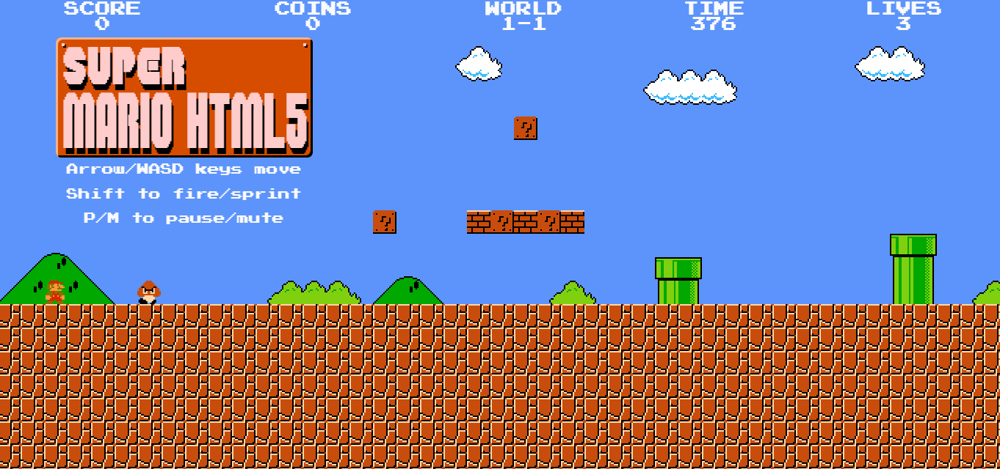
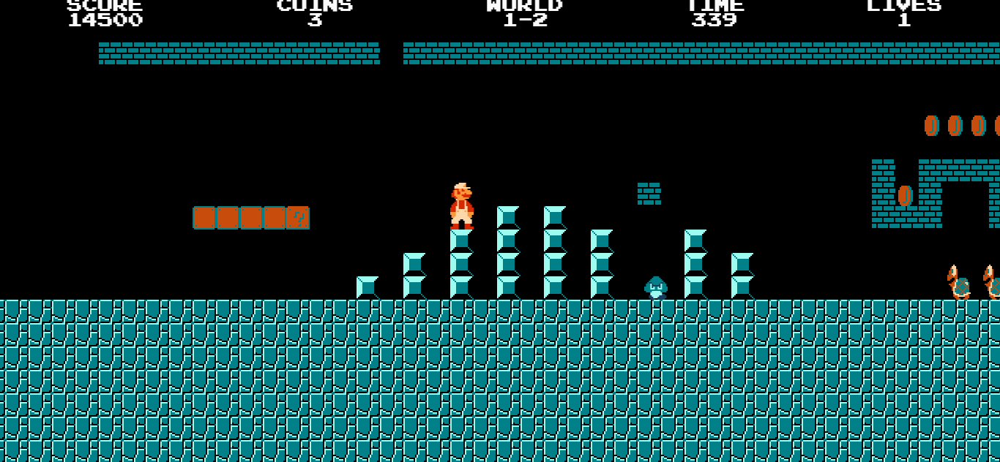
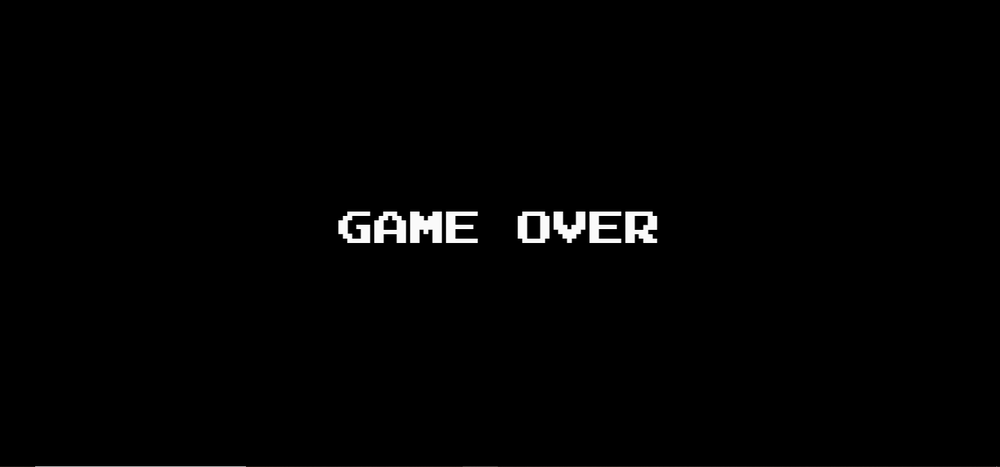

# Projet Docker : Super Mario Bros

Ce projet documente le déploiement d'un jeu Super Mario via un conteneur Docker.

## Étapes de réalisation

### 1. Récupération de l'image
L'image officielle a été récupérée depuis le Docker Hub avec la commande :
`docker pull sevenajay/mario:latest`

### 2. Lancement des conteneurs
J'ai lancé le conteneur en mappant le port **8600** de ma machine vers le port **80** du conteneur (Note : le port 8080 initialement prévu ne répondait pas car l'image utilise Nginx).

**Commande utilisée :**
`docker run -d -p 8600:80 --name mario-container-1 sevenajay/mario:latest`

### 3. Gameplay
Une fois le conteneur "Up", le jeu est accessible sur `http://localhost:8600`.

### 4. Nettoyage de l'environnement
Pour terminer proprement, le conteneur et l'image ont été supprimés :
- Arrêt et suppression du conteneur : `docker rm -f mario-container-1`
- Suppression de l'image : `docker rmi sevenajay/mario:latest`

## Outils utilisés
* Docker Desktop
* Terminal Windows (PowerShell)
* GitHub pour le versioning